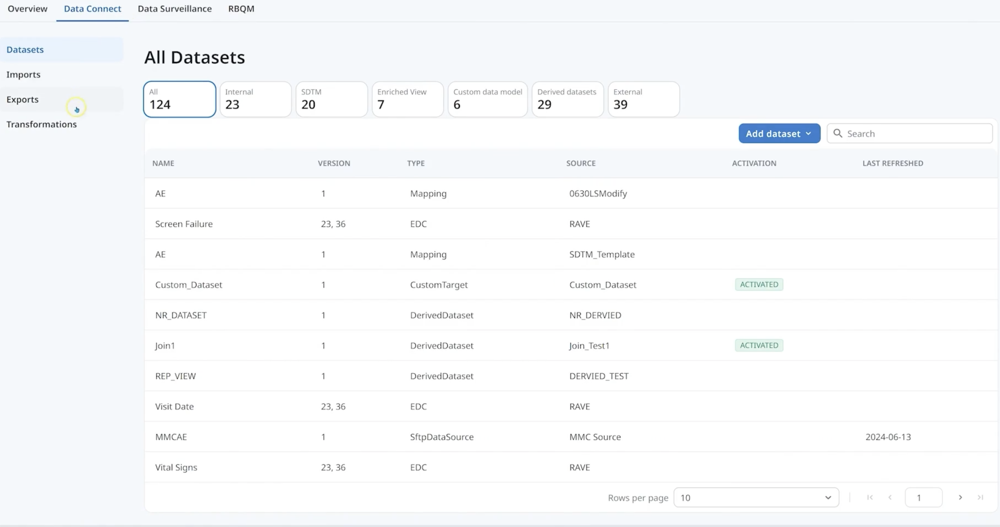
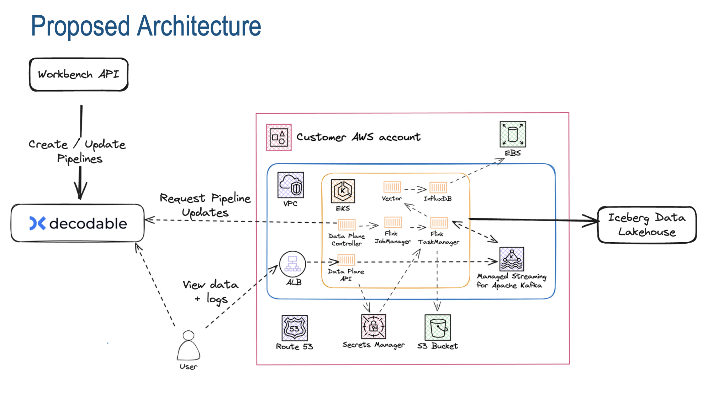

# Clinical Data Studio Lite

AI-assisted clinical data review prototype inspired by Medidata Clinical Data Studio.

> This is a simplified prototype inspired by real-world clinical data platforms, focusing on governed data ingestion, quality monitoring, and AI-assisted workflows in regulated environments.

---

## ⚡ At a Glance

- **What:** AI-native clinical data platform prototype  
- **Who:** Clinical data managers, CROs, compliance teams  
- **Why:** Reduce reconciliation effort, improve auditability, enable AI-ready workflows  

---

## 🧠 Overview
Clinical Data Studio Lite demonstrates how fragmented clinical datasets can be unified into a governed, real-time system for data review, validation, and AI-assisted workflows.

This project showcases:
- Product thinking for a clinical data platform
- Data quality monitoring and validation workflows
- UX for ingestion and discrepancy review
- Foundation for AI-native, compliance-aware systems

---

## 🌍 Market Context & Strategic Need

Clinical trials are becoming increasingly complex due to:
- Multi-vendor ecosystems
- Global regulatory requirements
- Increasing data volume and variability

At the same time, organizations are shifting toward:
- Real-time data visibility
- AI-assisted workflows
- Strong auditability and compliance

This creates a gap:

> Existing systems are optimized for storage and reporting — not real-time, governed, AI-ready workflows.

### Strategic Positioning
Clinical Data Studio is positioned as:
- System of record for clinical data quality
- Integration platform for partner ecosystems
- Foundation for responsible AI in regulated environments

---

## 🚨 Problem

Clinical trial data is often fragmented across sites, vendors, and systems.

This leads to:
- Manual reconciliation
- Delayed insights
- Data quality risks
- Lack of traceability

### Root Cause Analysis (People, Process, Technology)

- **People:** Teams optimized locally across disconnected tools
- **Process:** Manual reconciliation and inconsistent validation logic
- **Technology:** Custom ETLs, no canonical schema, no systemic lineage

This fragmentation prevented scalability and made AI unreliable.

---

## 🧠 Key Insight

**Trust is not a workflow problem — it is a system design problem.**

Without governed ingestion, standardized schemas, and lineage, downstream workflows and AI systems become unreliable.

---

## 👥 User Insights (JTBD)

Key user jobs identified through discovery:
- “Help me trust the data before making decisions”
- “Help me quickly identify and resolve discrepancies”
- “Help me prepare for audits without manual reconstruction”

### UX Implication
Shift from tool-based workflows to guided, system-driven workflows.

---

## ✅ Solution

A unified, governed platform that enables:
- Dataset ingestion and preview
- Automated quality checks and discrepancy detection
- Standardized data structures
- Foundation for AI-assisted reasoning on trusted data

---

## 💼 Business Case

From a business perspective, the platform addresses three critical levers:

- **Revenue:** Faster data readiness → faster milestone billing  
- **Cost:** Reduced manual reconciliation → lower cost-to-serve  
- **Deals:** Strong auditability and AI governance → higher enterprise win rates  

This reframes the product from a workflow tool → strategic platform investment.

---

## 🖥️ Product UI

### Main Product Experience


---

## 🏗️ System Architecture


---

## 🧪 MVP & Validation Strategy

### Hypotheses Tested
- AI can generate traceable, audit-ready outputs
- Standardized ingestion reduces integration complexity
- Early validation reduces downstream reconciliation effort

### MVP Scope
- Governed ingestion layer
- Canonical data model
- Basic discrepancy detection
- Initial AI-assisted validation

### Key Learnings
- Governance must precede AI scaling
- Standardization reduces onboarding effort significantly
- Explainability is critical for adoption in regulated environments

---

## 📈 Impact

### Operational
- Partner onboarding time ↓ 60%
- Integration defects ↓ 45%
- Data latency ↓ 80%
- Audit preparation time ↓ 50%

### AI + Workflow
- 50% faster discrepancy reviews
- 40% improvement in validation accuracy
- 100% traceable AI outputs

### Business
- Faster milestone billing → improved revenue realization
- Reduced cost-to-serve through automation
- Increased win-rate in regulated and enterprise deals

---

## 🧩 Design Decisions & Trade-offs

### Key Decisions
- Prioritized governance-first architecture before scaling AI
- Used RAG-based approach for explainability and auditability
- Selected hybrid BioGPT + BERT for domain-specific reasoning
- Introduced SDK-based integrations for partner standardization

### Trade-offs
- Slower initial velocity for long-term scalability
- Human-in-the-loop workflows over full automation
- Structured ingestion before advanced AI workflows

---

## 📊 Metrics & Measurement

### Data Layer
- Ingestion latency (p95)
- Schema validation failure rate
- Lineage completeness
- PHI detection accuracy

### Integration Layer
- Partner onboarding time
- Integration defect rate
- SDK adoption rate

### AI Layer
- Model accuracy (F1 score)
- Hallucination rate
- Evidence citation rate
- Human override frequency

---

## ⚖️ Prioritization Framework

All initiatives were evaluated using:
- Revenue leverage
- Risk reduction
- Operational efficiency
- Engineering sustainability
- Compliance impact

### Key Prioritization Decisions
- Built lineage before scaling AI
- Standardized integrations before scaling partners
- Stabilized ingestion before automation

---

## 🧑‍🤝‍🧑 Operating Model (People, Process, Technology)

- **People:** Alignment across Engineering, Data Science, Compliance, and UX
- **Process:** JTBD-driven discovery, instrumentation-led prioritization, iterative MVP validation
- **Technology:** Governed data plane, standardized integration layer, AI-ready architecture

---

## 📁 Repo Structure
```text
clinical-data-studio-lite/
├── README.md
├── requirements.txt
├── src/
│   └── ui.py
├── data/
│   └── sample_clinical_data.csv
├── docs/
│   └── product-requirements.md
└── architecture/
    └── architecture-notes.md
```
---

## 🛠 Tech Stack

-Python

-Streamlit

-Pandas

---

## 🚀 How to Run

```bash
pip install -r requirements.txt
streamlit run src/ui.py
```
---
## 🚀 Go-To-Market & Monetization

Positioned as:
Governed data platform + certified partner ecosystem + responsible AI

### 💰 Monetization Strategy

-Pricing aligns with value across:

-Ecosystem scale (number of integrations)

-Compliance readiness

-AI-assisted workflow efficiency

### Premium Features

-Partner certification

-Advanced APIs

-Compliance tooling

-Responsible AI workflows with audit exports

---

## 📊 Sample Data

A sample dataset is included in:
data/sample_clinical_data.csv

---

## 🧠 Product Framing

This prototype represents the early foundation of a clinical data platform:

  Ingestion and review
  
  Quality monitoring
  
  Issue identification
  
  Future AI-assisted workflows

---

## 🔮 Next Enhancements

→Anomaly detection

→ Patient profile view

→ Validation rules

→ Audit trail

→ Explainable AI layer

  ---

## 🏗 Architecture (Conceptual)

Clinical Data Sources

→ Ingestion Layer

→ Standardization Layer

→ Validation Layer

→ Review UI

---


## 👤 Author

Ishan
---

---
